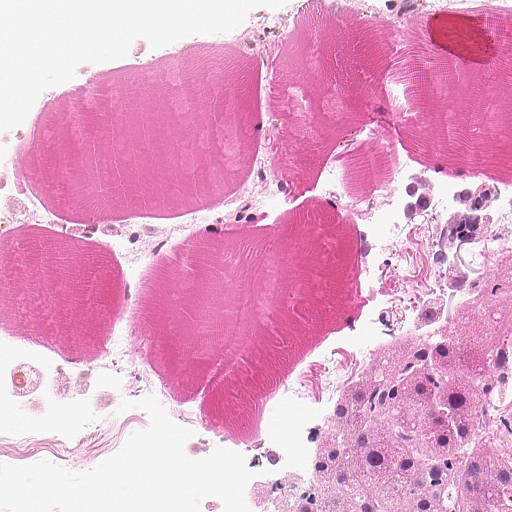
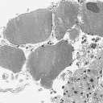

# 🌟 Daily Coding Challenge - AI & Healthcare 🧠🩺

Welcome to my daily coding journey! This repository is dedicated to my exploration and learning in the fields of AI and healthcare. Each day, I dive into coding tasks that enhance my skills, build projects, and push the boundaries of technology. 🚀


---

## 📖 About This Repository
This repository showcases my daily coding exercises, with a strong focus on AI applications in healthcare. It includes image processing tasks, machine learning algorithms, and more advanced AI techniques. 💡

## 📸 Sample Image Patches

Here are some of our sample image patches used in this challenge:

### Original vs Processed

#### Sample 1
**Original Patch:**


**Processed Patch:**



# 🚀 Machine Learning Model for Data Processing and Prediction

## Overview
This repository showcases a custom-built machine learning pipeline for efficient data processing and prediction generation. We split, process, and aggregate data seamlessly to meet project needs. ⚙️

### 🔑 Key Features:
1. **🔄 Input Processing**: 
   - The input tensor (500x64x64) was split into 8 smaller parts (500x64x8) for parallel processing.

2. **🧠 Mamba Model**: 
   - A specialized CNN processes each part, outputting tensors of size 240x240x`channel_size`.

3. **🔗 Concatenation**: 
   - The 8 outputs were combined into a final tensor with shape 500x240x240x(8x`channel_size`).

4. **🌀 Secondary Model**: 
   - The concatenated output is fed into another model, reducing the channel size to 10 while preserving the height and width.

## ✅ Final Output
- The final output shape is 500x240x240x10. 📊
- Results have been saved for evaluation. 🗂️


## 🛠️ Technologies Used
- **Python** 🐍
- **OpenCV** - For image processing
- **Numpy** - Numerical computations
- **Matplotlib** - Data visualization

1. Clone this repository:
   ```bash
   git clone https://github.com/asil07/daily-coding-challenge.git
